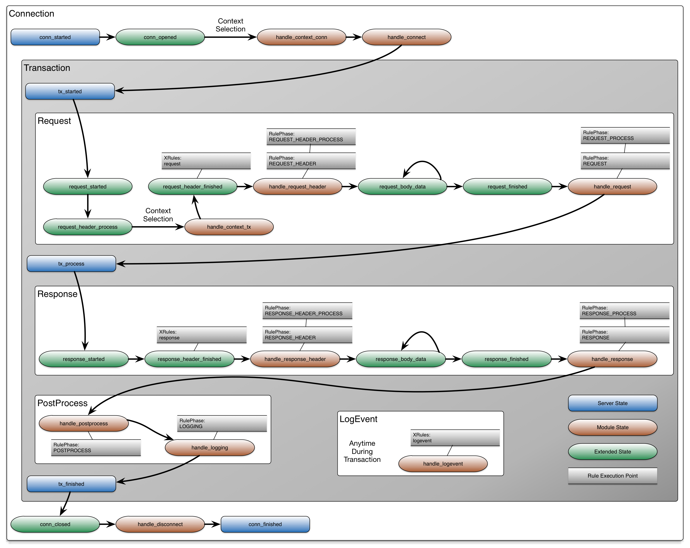
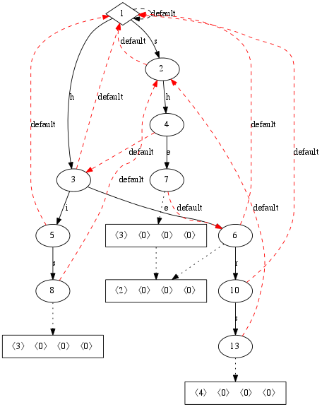

== Overview

TBD: Cleanup overview to deal with more than just inspection technique topics, but also tools and testing topics.

Inspecting data in IronBee is powerful, but with this power comes complexity. There are numerous methods for inspecting traffic in IronBee. While, this allows great flexibility, it also comes with the cost of having to make some decisions. Different inspection techniques lend to different methods. This guide explains the various inspection methods in order to make it easier to decide which techniques to use.

In addition to different inspection techniques, IronBee supplies you with a number of tools to aid writing and testing inspection.

=== State Machine

In order to understand inspection, you must understant how IronBee processes data. IronBee flows through a state machine during each connection. An idealized diagram (of this state machine for a connection containing a single transaction is below. In addition to the idealized states, the diagram indicates where rule modules hook into IronBee. Note that this diagram shows only a single transaction within a connection. The transaction state machine can repeat many times within a connection.

.IronBee States

=== Available Inspection Options

Inspecting data is performed through rules and modules. Rules are encapsulated logic executed at well define points in the transaction lifecycle. IronBee has a rule engine that exposes a system to execute rules. There are several IronBee module that implement various types of rules that tie into and extend the rule engine. The rule engine is quite powerful by itself, but when you need more control, then custom modules can be used to extend the rule engine further or perform inspection in the module itself. Rules allow basic inspection with an array of operators and have multiple different interfaces/syntax to meet different needs, but they have limited flow control (e.g., no clear looping and if/then/else functionality). Modules give you the full power of C/C++ or Lua programming languages and ultimate flexibility, but are somewhat more cumbersome to write and update.

==== Rule Based Inspection

IronBee provides a generic framework for scheduling and excuting operators and performing actions via rules - a rule engine. The state diagram indicates where the rule engine executes rules.  These points are called ``phases''. While most rule systems use the rule engine, this is not required. Note that the term ``Rules'' is used loosly here as IronBee does not limit what functionality a rule can provide nor syntax for defining rules. A rule is defined generically as some meta data, an operation to perform (typically on some data, such as a regular expression) and one or more actions to execute based on the results of this operation. A number of different rule systems and syntaxes exist; all with different goals. These different systems are encapsulated into modules that can be loaded into IronBee, which means that you only need to load the functionality that you need. To perform inspection, howerver, you need to choose what techniques to use (e.g., what modules to load).

===== Configuration Based Rules

The simplest form of rules are configuration directive based. Of these, there are currently two systems, XRules and the IronBee Rule Language.

XRules::

XRules (eXtended Rules), loaded via the `xrules` module, allow writing simple rules to perform common tasks. XRules do not use the rule engine. Because of this, they avoid some complexity by making assumptions based on the type of rule. For example, you do not have to specify a phase as that phase is inherit in the type of rule.  Additionally XRules are designed for fast execution and same type rules are often combined together into a larger, but more efficient operation. XRules are typically used to perform firewall like operations, allow dynamic configuration to control inspection, and perform exceptions for other rule systems.
+
A good example of all of this is IP based blocking rules. These are done via the `XRuleIPv4` and `XRuleIPv6` directives. No phase is needed as these rules will run as early as possible. And to be efficient, all IP based rules are combined together into a single IP set matching algorithm, so no matter how many IP based rules you create, they will all be combined into a single matching operation.
+
.XRule Example for performing IP based blocking.
----
# Block a few subnets
XRuleIpv4 10.2.3.0/24 block
XRuleIpv4 192.168.0.0/16 block
# But allow a specific IP
XRuleIpv4 192.168.2.3 allow
----
+
Dynamic configuration is also typical of XRules. As an example, you may want to change aspects of inspection based on the request path. Here you could use `XRulePath` to do this. Again, no phase is required as this will be done as soon as possible. Multiple rules can be combined into a path prefix set to optimize performance. And the path comparison is automatically performed on a normalized path.
+
.XRule Example for performing path based inspection configuration.
----
# Enable blocking mode for the admin section of the site
XRulePath /admin enableBlockingMode
----
+
As you can see, these are fairly simple rules. But to get this simplicity, you lost some control due to assumptions being made for you. All of these XRule base rules could also be implemented by other forms of rules if you need more flexibility or control.

IronBee Rule Language::

The IronBee rule language, loaded via the `rules` module, allows for defining simple rules within the IronBee configuration. These rules utilize the basic rule engine to provide linear execution of rules per execution phase. Due to the limited syntax of the configuration language, these rules are typically only going to be useful for basic signature type rules.
+
.Basic Rule Directive Syntax:
----
Rule SOME_FIELD @operator "operator argument" id:some_id rev:1 phase:PHASE action1:action1_argument action2 ...
----
+
To compare with XRules, here is as example of the same functionality described for XRules written using the IronBee Rule Language. These are not quite equivilent as the XRules versions would run much earlier and multiple separate XRules would still be combined into single matches.
+
.XRules Implemented as Rules
----
# Block a few subnets, excluding a single IP
Rule REMOTE_ADDR @ipmatch "10.2.3.0/24 192.168.0.0/16 !192.168.2.3" id:rule/1 phase:REQUEST_HEADER block

# Enable blocking mode for the admin section of the site
Rule REQUEST_URI_PATH @strmatch_prefix "/admin" id:rule/2 phase:REQUEST_HEADER setflag:enableBlockingMode
----

===== Lua DSL Based Rules (Waggle)

A Lua based Domain Specific Language (DSL) was created to offer greater flexibility over the configuration directive based rules. It was named "waggle" after the bee dance -- keeping with our Bee theme. Essentially you get the same rule logic as with the directive based rules, but in a Lua environment where you can build templates, loops and other logic around the ruleset *generation*. Lua is executed only at configuration time, so there is no difference in execution speed from the directive based rules - only a more flexible syntax.

The syntax is similar in content to the IronBee Rule Language. You still have a set of data fields as input, an operator, a phase and actions. 

[source, lua]
.Basic Lua Rule Example:
----
Rule("some_id", 1):
    field("SOME_FIELD"):
    op("operator", "operator argument"):
    phase("PHASE"):
    action("action1:action1_argument"):
    action("action2")
    action("...")
----

The real benefit over a less limited syntax, is being able to templatize the rules. That is, being able to define a simpler syntax for commonly used rule patterns and specify defaults. For example you may always want to execute a set of rules where the only items that vary are the operator and argument. To do this you you can just define a new Lua function that returns the templatized rule function, taking the operator and argument as a parameter.

[source, lua]
.Templatized Lua Rule Example:
----
-- Template "trule" that takes id, field name,
-- operator name and argument as parameters.
trule = function(id, field_name, op_name, op_arg)
  return Rule("some_id", 1):
             field(field_name):
             op(op_name, op_arg):
             phase("PHASE"):
             action("action1:action1_argument"):
             action("action2")
             action("...")
end

-- Use the template to create many rules.
trule(1, "FIELD1", "op1", "op_arg1")
trule(2, "FIELD2", "op2", "op_arg2")
trule(3, "FIELD3", "op3", "op_arg3")
trule(4, "FIELD4", "op4", "op_arg4")
----

==== Advanced Rule Based Inspection

There are a number of other more advanced inspection techniques available in IronBee.

Automata Based Matching::
+
IronBee comes with an automata framework called IronAutomata, which allows for building automata with various matching algorithms (currently Trie and Aho-Corasick). These are designed to build up large list type matches. If you have large lists of fixed width patterns (spam keywords, URLs, User Agents, etc.), then you can build up a binary version of these using the included IronAutomata tools. These automata are compiled and optimized for fast lookup into a ``Eudoxus Automata'', which is a portable automata runtime used by the IronAutomata framework. The `ee` (Eudoxus Executor) module can then execute these automata.
+
For example, consider a simple list: he, she, his, hers
+
This would be compiled (note this is not optimized for easier reading) into something like the following diagram. This allows for parallel matching (one pass through the input vs one pass per pattern) of all patterns in a fast manner in the provided input.
+

+
Passing input such `she saw his world as he saw hers...` through would match the following. The numeric values are the offsets of the end of the patterns in the input.
+
.Example Execution
----
> echo "she saw his world as he saw hers..." | bin/ee example.e
Loaded automata in 0.086263 milliseconds
       3: she
       3: he
      11: his
      23: he
      30: he
      32: hers
Timing: eudoxus=0.009763 milliseconds output=0.172022 milliseconds
----

Fast Pattern Rule Optimization::
+
If you are executing many regular expression matches, then fast pattern optimization may be able to significantly increase performance at the cost of some additional work in configuration. Fast patterns use automata to do a fized pattern pre-match against static patterns in your regular expressions. This is a one-time automata match that will then result in enabling only the rules that could potentially match. Performance is gained by reducing the number of regular expressions that need to be executed.
+
To use fast patterns, however, you need to build up an automata of static patterns from your regular expressions and include this in your configuration. IronBee does provide a utility to help with this by extracting recommended static patterns from regular expressions. However, applying these suggestions and building the automata is a manual process. If you use a large number of regulare expression rules, though, the performance gain could be well worth the extra configuration steps.

==== Module Based Inspection

===== C/C++ Module

The other rule systems are all built using a C/C++ module. These rule modules typically extend the rule support by tying into the rule engine (notable exception being xrules). However, you do not have to build modules to extend IronBee - you can perform inspection logic here as well as create operators, transformations and actions that other rules can use. Your logic will be compiled into a shared library that IronBee can then load. Inspection can be run at any point which a module can hook into IronBee, giving endless possibilities.

===== Lua Module

Similar to C/C++ modules, you can also build modules using Lua. The main difference here is that Lua modules are not shared librarys, but just lua scripts, so they are very easy to distribute like rules.

